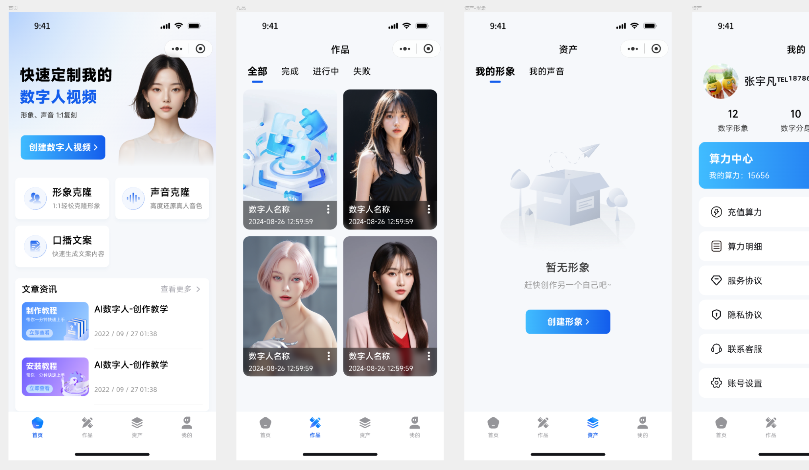
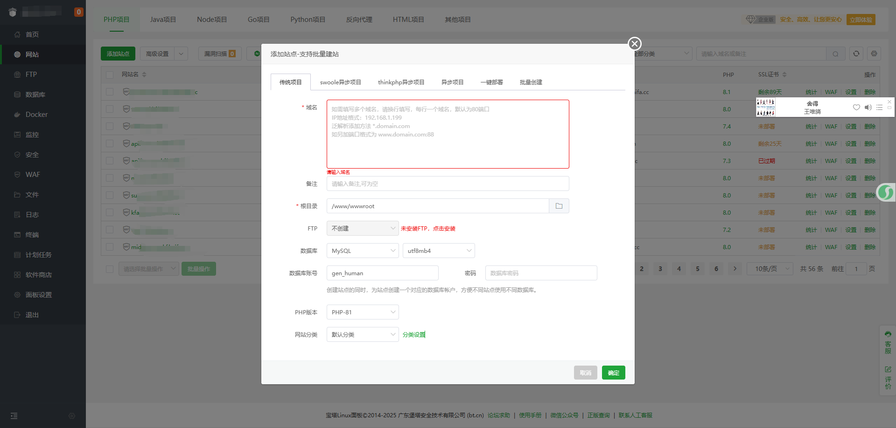
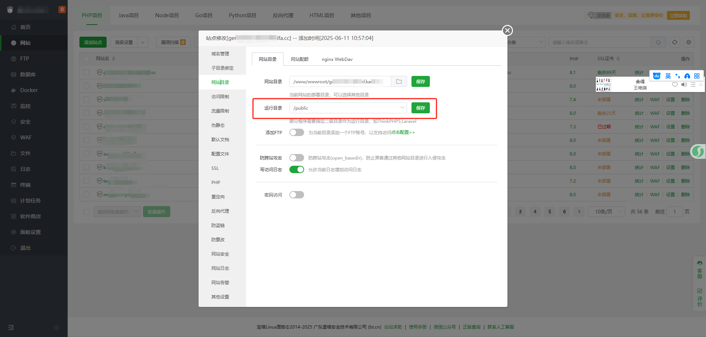
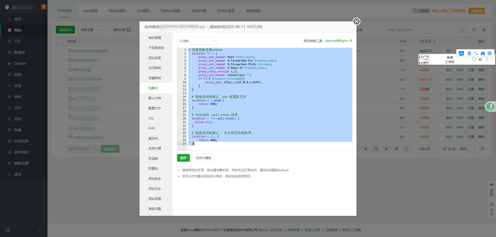
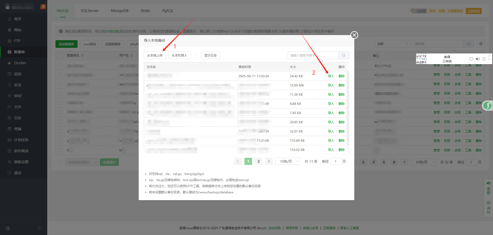
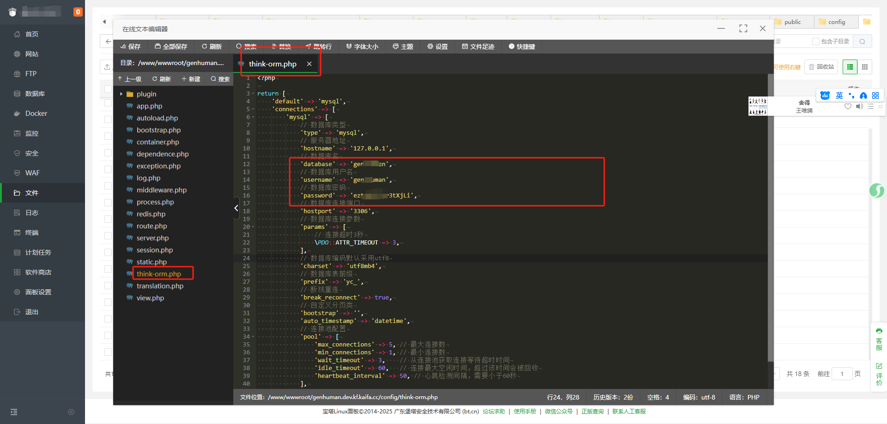
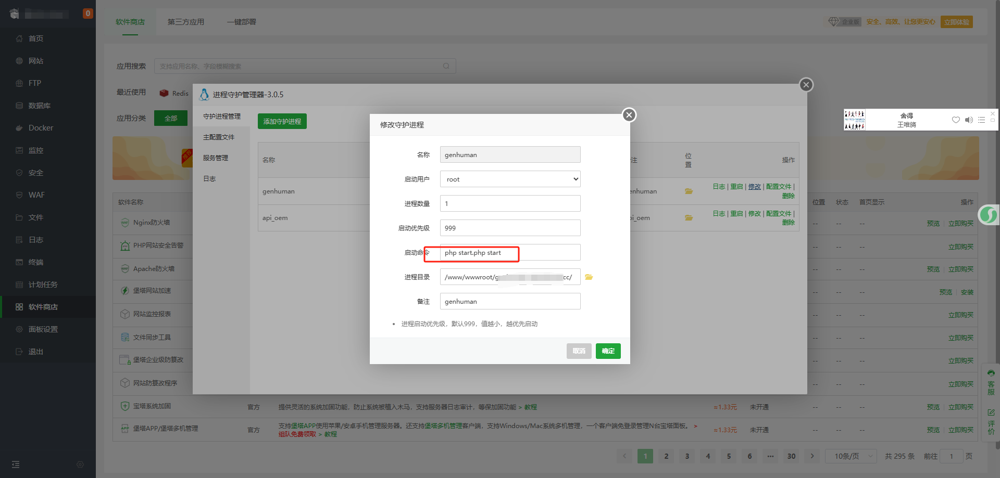

<div align="center">
  
</div>

<div align="center">
  <u><h1>GenHuman - 一个可直接部署商用变现的数字人项目.</h1></u>
</div>

# What is GenHuman?🚀

<div align="center">
  
</div>

<br />

GenHuman是一款基于API的数字人产品，包括web、应用程序、微信小程序、后端管理。一键部署、开箱即用的项目。

UI界面简洁大气，功能齐全，可直接部署商用变现，开发不易，大家且行且珍惜。

<br />

# List of Future Plans for the Project

- [x] User System Management

- [x] Package recharge management

- [x] Sound Clone Management

- [x] Digital human cloning

- [x] Digital human generation

- [x] Large model copywriting creation

- [x] WeChat official account H5 management

- [x] WeChat Mini Program Management

- [x] Digital Human API Interface Configuration Management

- [ ] AI painting

- [ ] AI Music

- [ ] Facial Fusion

- [ ] Photo digital person

- [ ] AI replacement

- [ ] Handheld digital person

- [ ] AI digital human model

- [ ] AI Photography

- [ ] AI Hairstyle Management

# Highlights

- Based on the webman framework, it has high concurrency capability and runs more smoothly.  
- The backend is developed using PHP, which has stronger scalability, is easy to learn, and is also easy to deploy.  
- The client is developed using Uniapp, which can be packaged and run across terminals, and compiled into apps, mini programs, H5, web, and other clients with just one click.  
- No need to deploy a digital human model, directly integrate with online API interfaces to achieve digital human creation.  
- Yiding Open Platform（ https://api.yidevs.com ）Provide stable technical support, or you can integrate with other third-party API interfaces.  
- Provide comprehensive installation tutorials for digital humans, which can be deployed for commercial monetization without worrying about copyright.  
- More highlights waiting for you to discover

<br>

# App Examples

Here are some UI pages displayed. If you have better ideas, you can directly raise an issue.

<div align="center">
  
</div>

# Quick Start

I use bt.cn for installation. If your installation method is different, please study it yourself.

Environment supported by GenHuman

- PHP8.1、Mysql5.7、Nginx

Required extensions ：   Consistent with the official framework installation of webman

> Before installation, execute the command to unlock the function, just in case. 

``` python
curl -Ss https://www.workerman.net/webman/check | php
```

### 1、new site
<div align="center">
  
</div>

### 2、Set access directory
<div align="center">
  
</div>

### 3、Set pseudo static
<div align="center">
  
</div>

<br />

```javascriopt
# 将请求转发到webman
  location ^~ / {
      proxy_set_header Host $http_host;
      proxy_set_header X-Forwarded-For $remote_addr;
      proxy_set_header X-Forwarded-Proto $scheme;
      proxy_set_header X-Real-IP $remote_addr;
      proxy_http_version 1.1;
      proxy_set_header Connection "";
      if (!-f $request_filename){
          proxy_pass http://127.0.0.1:8787;
      }
  }

  # 拒绝访问所有以 .php 结尾的文件
  location ~ \.php$ {
      return 404;
  }

  # 允许访问 .well-known 目录
  location ~ ^/\.well-known/ {
    allow all;
  }

  # 拒绝访问所有以 . 开头的文件或目录
  location ~ /\. {
      return 404;
  }

```

### 4、Import database file
<div align="center">
  
</div>

<br />

### 5、Modify database configuration

<div align="center">
  
</div>

<br />

### 6、Add daemon process

<div align="center">
  
</div>

<br />

- If you have multiple PHP versions in your current environment, simply specify them, for example: php 81 start. php start

### 7、Accessing the management backend
 
>https://Your Domain/admin

>Account: admin

>Password: 123456

# Contact

For questions or suggestions, feel free to reach out:

- Email: 416716328@qq.com
- Wechat/Tel: 18786709420

由于代码仓库限制，uniapp代码无法上传，如需uniapp代码，请直接与我联系。

<br />

# 感谢贡献

- hbernet：(https://github.com/Hbernet)
- sunbo11112(https://github.com/sunbo11112)
- xhadmin(https://xhadmin.cn/)